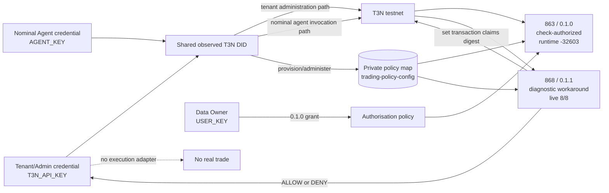

# T3N Secure Trading Policy Agent

A proof-of-concept deterministic TEE policy layer between an AI trading agent and execution infrastructure. A Rust contract hosted by T3N reads tenant-owned policy and returns `ALLOW` or `DENY`. This repository never submits a trade, holds no exchange or wallet execution credentials, and uses no funds.

## Why this exists

An LLM is useful for proposing actions, but prompt injection, hallucinations, and compromised context make it a poor security boundary. The TEE contract remains the deterministic policy boundary. Credential modules and process environments are separated operationally, but the tested tenant/admin and nominal-agent credentials resolved to the same T3N DID, so this deployment does not claim a T3N principal or privilege boundary between them.



The LLM proposes. The TEE contract enforces deterministic policy. The admin and nominal-agent code paths use different credential values and modules, but no T3N authorization boundary between those credentials was observed. The successful live result is from diagnostic version 0.1.1, which intentionally omits `check-authorized`; it demonstrates TEE policy execution, not independent agent/data-owner authorization.

## Integer policy units

Money is represented as integer US-dollar cents and confidence as integer basis points. The Rust policy engine contains no floating-point monetary or confidence comparisons.

| Meaning | Wire value |
|---|---:|
| USD 500.00 | `notionalUsdCents: 50000` |
| USD 1,000.00 limit | `maxTradeNotionalUsdCents: 100000` |
| 91% confidence | `confidenceBps: 9100` |
| 80% minimum | `minConfidenceBps: 8000` |

Example intent:

```json
{
  "symbol": "SOL",
  "side": "BUY",
  "notionalUsdCents": 50000,
  "venue": "JUPITER",
  "confidenceBps": 9100,
  "dailyLossUsdCents": 10000
}
```

The default policy allows `SOL` and `BTC` on `JUPITER`, caps a proposed trade at 100,000 cents, caps the caller-supplied daily-loss value at 50,000 cents, and requires 8,000 basis points of confidence.

## Credential paths and observed identity

Never place all three credentials in one runtime or shell.

| Operational path | Environment | Intended responsibility |
|---|---|---|
| Tenant/admin | `T3N_API_KEY` | Tenant verification, contract registration, map provisioning, policy administration |
| Data owner | `USER_KEY`, plus public `AGENT_DID` | Grant or revoke the agent's exact contract/function authority |
| Nominal agent runtime | `AGENT_KEY` | Application code invokes `evaluate-trade`; the demo module does not construct `TenantClient` |

On 2026-09-02, the different `T3N_API_KEY` and separately issued `AGENT_KEY` values both authenticated as `did:t3n:f62da0c78b9ffd0fce31193d4e7db02f272adc0e`. With only `AGENT_KEY` present, read-only calls to `tenant.me()`, `maps.getStatus`, `maps.entryGet(current)`, and `contracts.listDetailed` all succeeded. No tenant control-plane write was tested. Consequently, process-level secret separation remains useful operational hygiene, but it is not evidence of T3N authorization separation and creates no demonstrated protection against tenant writes.

### Agent onboarding choice

This demo used the public/self-authenticating onboarding flow for an individual tenant. In this test environment it produced a different credential value that resolved to the same DID as the tenant/admin credential:

1. Obtain a separately issued credited agent key from the T3N claim page.
2. In an agent-only shell, use the SDK CLI with `--api-key $env:AGENT_KEY` to run `whoami`, scaffold/host the public agent card, and verify it.
3. Copy the session-returned DID into `AGENT_DID` in the separate data-owner authorization shell.
4. The recorded 0.1.0 flow used `npm run authorize` with `USER_KEY` and `AGENT_DID`. The SDK helper implementing the documented `agent-auth-update` flow performs a read/merge/write for only `trading-policy@0.1.0::evaluate-trade`, with empty data scopes and no outbound hosts, while preserving unrelated grants.
5. `npm run demo:live` targets 0.1.0 using only `AGENT_KEY`; that registered contract repeatedly failed at runtime with `action.execute` error `-32603`.

`USER_KEY` is required for the 0.1.0 authorization bootstrap because the grant is a SelfOnly data-owner write. It is not required or read by the nominal-agent execution module. Any future retry of that authorization design in this environment is a self/shared-DID flow and must not be described as proof of cross-principal delegation.

## Tenant policy storage

- Contract: `z:<tenant-id>:trading-policy`
- Policy map: `z:<tenant-id>:trading-policy-config`
- Entry key: `current`

The contract constructs the map name from the host-provided tenant DID. The original setup created the private map for contract 863 and verified its policy value. A later readers-only patch requesting `[863, 868]` was accepted with SDK response `{}` so diagnostic version 0.1.1 could read the same policy. SDK 5.5.0 exposes no ACL readback API, so the final reader list was not independently retrieved; no other map setting or policy value was included in that patch.

## Prerequisites and install

- Node.js 18+
- Rust with `wasm32-wasip2`
- Visual Studio C++ Build Tools for Windows native tests
- `@terminal3/t3n-sdk@5.5.0`

```powershell
cd C:\project\superteam\secure-trading-policy-agent\client
npm install
```

## Local build and QA

These commands do not contact T3N:

```powershell
cd C:\project\superteam\secure-trading-policy-agent\contract
cargo fmt --all -- --check
cargo build --target wasm32-wasip2 --release
cargo test --lib --target x86_64-pc-windows-msvc
cargo clippy --all-targets --target x86_64-pc-windows-msvc -- -D warnings
cargo clippy --target wasm32-wasip2 --release -- -D warnings

cd ..\client
npm install
npm run typecheck
npm run demo
```

Bare `cargo test --lib` inherits the repository's WASM default target, which Windows cannot execute directly. Always select the native MSVC target as shown.

## Live testnet result

Two immutable versions are recorded under the same contract tail:

| Version | Contract ID | Authorisation host path | Observed result |
|---|---:|---|---|
| `0.1.0` | 863 | Imports `host:interfaces/authorisation@2.1.0`; calls `check-authorized` at entry | Repeated `action.execute` `-32603 Internal error` |
| `0.1.1` | 868 | Diagnostic workaround removes only that import/call | Live T3N testnet TEE demo passed 8/8 scenarios |

The evidence strongly isolates the failure to the `host:interfaces/authorisation@2.1.0` / `check-authorized` path in the tested T3N testnet environment. Local WIT accepts it and 0.1.0 registered successfully, but runtime execution failed; removing that dependency made the otherwise equivalent contract execute successfully. This appears to be a host-surface/runtime compatibility discrepancy, not mathematical proof of causation or a confirmed T3N security vulnerability.

Do not re-register either version or rerun setup. The successful 0.1.1 demo contacted no exchange and executed no trade.

## Demo modes

`npm run demo` runs eight fixtures through a trusted local harness. It is useful for deterministic output review but is not evidence of T3N execution.

`npm run demo:live` retains the original 0.1.0 nominal-agent path for reproducing the `-32603` result. It uses `AGENT_KEY`, validates the session DID, calls `T3nClient.executeAndDecode`, and runtime-validates decoded decisions if one is returned.

`npm run demo:live:0.1.1` uses `T3N_API_KEY` and `TenantClient.contracts.execute` against registered contract 868. The recorded run returned every expected result: two `ALLOW` decisions and six `DENY` decisions, including all six ordered reasons for the multi-violation case. This is the successful 8/8 T3N TEE policy demo. Because 0.1.1 omits `check-authorized`, it does not demonstrate a separate agent principal, cross-principal delegation, or successful authorisation-host enforcement.

## Audit statement

The contract SHA-256 hashes its serialized decision and calls the vendored `kv-store.set-claims-digest` host function. Therefore, the contract **sets the transaction claims digest**. This repository does not independently retrieve or verify a T3N receipt, and it does not claim that verification has occurred. Receipt retrieval and independent verification remain future work.

## TESTNET-ONLY trust limitation

SDK 5.5.0 exposes the `fetchTrustedManifest("testnet")` path. A live read-only recheck on 2026-09-02 still returned: `Trust manifest at https://cn-api.sg.testnet.t3n.terminal3.io/api/trust-manifest is malformed.` The client therefore isolates an explicit `{ unsafe_trust_server: true }` workaround for this bounty testnet only.

This disables server attestation verification and is not production-safe. Production must restore a verified TrustAnchor and fail closed on verification failure. See [docs/BUGS.md](docs/BUGS.md).

## Security limitations and production path

The tested tenant/admin and nominal-agent credentials share one observed T3N DID, and the nominal-agent credential successfully performed tenant control-plane reads. Write/admin mutation authority was not tested and is unknown. Diagnostic 0.1.1 has no `check-authorized` gate. The caller also supplies `dailyLossUsdCents` and `confidenceBps`; the contract validates their ranges and thresholds but cannot prove their provenance. Production must resolve the authorisation-host compatibility discrepancy, restore and verify caller authorization, clarify T3N credential/onboarding semantics, derive risk state from trusted protected sources, restore verified TrustAnchor handling, isolate wallet custody, add replay controls and independent receipt verification, and undergo independent security review.

No current code is authorized to control real funds.
