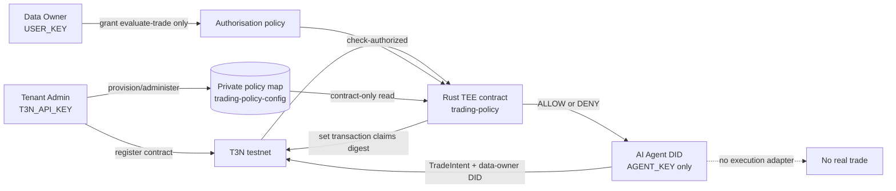

# T3N Secure Trading Policy Agent

A proof-of-concept deterministic TEE authorization layer between an AI trading agent and execution infrastructure. A separately authenticated agent proposes a trade; a Rust contract hosted by T3N reads tenant-owned policy and returns `ALLOW` or `DENY`. This repository never submits a trade, holds no exchange or wallet execution credentials, and uses no funds.

## Why this exists

An LLM is useful for proposing actions, but prompt injection, hallucinations, and compromised context make it a poor security boundary. The LLM therefore has no tenant administration credential and cannot rewrite the policy it is evaluated against.



The LLM proposes. The TEE authorizes. The tenant administrator controls deployment and policy through a completely separate credential path.

## Integer policy units

Money is represented as integer US-dollar cents and confidence as integer basis points. The Rust policy engine contains no floating-point monetary or confidence comparisons.

| Meaning | Wire value |
|---|---:|
| USD 500.00 | `notionalUsdCents: 50000` |
| USD 1,000.00 limit | `maxTradeNotionalUsdCents: 100000` |
| 91% confidence | `confidenceBps: 9100` |
| 80% minimum | `minConfidenceBps: 8000` |

Example intent:

```json
{
  "symbol": "SOL",
  "side": "BUY",
  "notionalUsdCents": 50000,
  "venue": "JUPITER",
  "confidenceBps": 9100,
  "dailyLossUsdCents": 10000
}
```

The default policy allows `SOL` and `BTC` on `JUPITER`, caps a proposed trade at 100,000 cents, caps the caller-supplied daily-loss value at 50,000 cents, and requires 8,000 basis points of confidence.

## Separate identities

Never place all three credentials in one runtime or shell.

| Principal | Environment | Allowed responsibility |
|---|---|---|
| Tenant administrator | `T3N_API_KEY` | Tenant verification, contract registration, map provisioning, policy administration |
| Data owner | `USER_KEY`, plus public `AGENT_DID` | Grant or revoke the agent's exact contract/function authority |
| Agent runtime | `AGENT_KEY` | Invoke `evaluate-trade`; no `TenantClient`, registration, map, or policy APIs |

Each DID is read from its authenticated T3N session. No DID is derived from a key or hardcoded in application source.

### Agent onboarding choice

This demo uses the current documented public/self-authenticating agent flow because the existing tenant is an individual tenant and no organization is required:

1. Obtain a fresh credited agent key from the T3N claim page. Do not reuse the tenant key.
2. In an agent-only shell, use the SDK CLI with `--api-key $env:AGENT_KEY` to run `whoami`, scaffold/host the public agent card, and verify it.
3. Copy the session-returned DID into `AGENT_DID` in the separate data-owner authorization shell.
4. After the contract is registered, run `npm run authorize` with `USER_KEY` and `AGENT_DID`. The SDK helper implementing the documented `agent-auth-update` flow performs a read/merge/write for only `trading-policy@0.1.0::evaluate-trade`, with empty data scopes and no outbound hosts, while preserving unrelated grants.
5. `npm run demo:live` uses only `AGENT_KEY`; it reads non-secret local authorization metadata to supply the data-owner DID as `pii_did`.

`USER_KEY` is required for the authorization bootstrap because the grant is a SelfOnly data-owner write. It is not required or read by the agent execution path.

## Tenant policy storage

- Contract: `z:<tenant-id>:trading-policy`
- Policy map: `z:<tenant-id>:trading-policy-config`
- Entry key: `current`

The contract constructs the map name from the host-provided tenant DID. Setup converges the map on every run to private visibility, current contract-ID read access, no business-contract writers, and tenant-admin read-back. It then refuses to overwrite a different policy and verifies the intended value.

## Prerequisites and install

- Node.js 18+
- Rust with `wasm32-wasip2`
- Visual Studio C++ Build Tools for Windows native tests
- `@terminal3/t3n-sdk@5.5.0`

```powershell
cd C:\project\superteam\secure-trading-policy-agent\client
npm install
```

## Local build and QA

These commands do not contact T3N:

```powershell
cd C:\project\superteam\secure-trading-policy-agent\contract
cargo fmt --all -- --check
cargo build --target wasm32-wasip2 --release
cargo test --lib --target x86_64-pc-windows-msvc
cargo clippy --all-targets --target x86_64-pc-windows-msvc -- -D warnings
cargo clippy --target wasm32-wasip2 --release -- -D warnings

cd ..\client
npm install
npm run typecheck
npm run demo
```

Bare `cargo test --lib` inherits the repository's WASM default target, which Windows cannot execute directly. Always select the native MSVC target as shown.

## First live testnet sequence

Run these only after reviewing the testnet trust limitation and placing each credential in its separate shell/process.

Tenant administrator shell:

```powershell
$env:T3N_API_KEY = "<tenant-admin-key>"
npm run register
npm run setup
```

Data-owner authorization shell:

```powershell
$env:USER_KEY = "<data-owner-key>"
$env:AGENT_DID = "<session-derived-agent-did>"
npm run authorize
```

Agent-only shell:

```powershell
$env:AGENT_KEY = "<separate-agent-key>"
npm run demo:live
```

Registration remains fixed at tail `trading-policy`, version `0.1.0`. It refuses an existing local record and checks live tenant inventory before registering. No automatic version bump exists.

## Demo modes

`npm run demo` runs eight fixtures through a trusted local harness. It is useful for deterministic output review but is not evidence of T3N execution.

`npm run demo:live` authenticates only the separate agent, validates that its session DID matches the data-owner grant, calls the contract through `T3nClient.executeAndDecode`, and runtime-validates every returned field and reason code. It does not construct `TenantClient`.

## Audit statement

The contract SHA-256 hashes its serialized decision and calls the vendored `kv-store.set-claims-digest` host function. Therefore, the contract **sets the transaction claims digest**. This repository does not independently retrieve or verify a T3N receipt, and it does not claim that verification has occurred. Receipt retrieval and independent verification remain future work.

## TESTNET-ONLY trust limitation

SDK 5.5.0 exposes the `fetchTrustedManifest("testnet")` path. In an earlier reproduced attempt, that call returned a malformed-manifest error. The client therefore isolates an explicit `{ unsafe_trust_server: true }` workaround for this bounty testnet only. Remote testnet state may have changed and must be rechecked before live deployment.

This disables server attestation verification and is not production-safe. Production must restore a verified TrustAnchor and fail closed on verification failure. See [docs/BUGS.md](docs/BUGS.md).

## Security limitations and production path

The caller still supplies `dailyLossUsdCents` and `confidenceBps`; the contract validates their ranges and thresholds but cannot prove their provenance. Production must derive risk/accounting state from trusted protected sources. Other required work includes verified TrustAnchor handling, separately authorized Solana/Jupiter execution, isolated wallet custody, replay controls, multi-agent approval, independent receipt verification, append-only decision reporting, audited policy administration, and independent security review.

No current code is authorized to control real funds.
