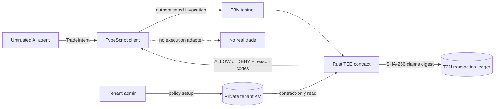

# T3N Secure Trading Policy Agent

A proof-of-concept deterministic TEE authorization layer between an AI trading agent and execution infrastructure. The AI proposes a trade; a Rust contract hosted by T3N reads tenant-owned policy and returns `ALLOW` or `DENY`. This repository never submits a trade, holds no exchange or wallet credentials, and uses no funds.

## The problem

An LLM can be useful for proposing actions, but prompt injection, hallucinations, and compromised context make it a poor security boundary. An enterprise trading agent therefore should not possess unconstrained execution authority. This project moves the final policy decision into deterministic code running behind the T3N tenant boundary.



The LLM proposes. The TEE authorizes.

## What is enforced

The default policy allows `SOL` and `BTC` on `JUPITER`, limits a single proposed trade to USD 1,000, limits the supplied daily-loss state to USD 500, and requires confidence of at least `0.80`. The contract reports all applicable violations in a fixed order using machine-readable codes.

Policy is stored at `z:<authenticated-tenant-id>:trading-policy`, key `current`. The tenant DID is obtained from the authenticated session and is never hardcoded. The map setup scopes contract reads to the registered contract ID, enables tenant-admin read-back, and gives no contract writer permission. Tenant administrators use the T3N control plane to initialize it.

## Prerequisites

- Windows 11 or another Rust/Node-supported platform
- Node.js 18+
- Rust with `wasm32-wasip2`
- On Windows, Visual Studio C++ Build Tools for the MSVC native test target
- A T3N testnet API key only for registration, policy setup, or live execution

The API key is used by the SDK for authentication. It is not an exchange key or a wallet private key used to move funds.

## Setup

```powershell
cd C:\project\superteam\secure-trading-policy-agent\client
npm install
$env:T3N_API_KEY = "your-testnet-key"
```

Never commit `.env` files or paste the key into source, logs, screenshots, or issue reports.

## Build and test

```powershell
cd C:\project\superteam\secure-trading-policy-agent\contract
cargo build --target wasm32-wasip2 --release
cargo test --lib --target x86_64-pc-windows-msvc
cargo clippy --all-targets --target x86_64-pc-windows-msvc -- -D warnings
cargo clippy --target wasm32-wasip2 --release -- -D warnings

cd ..\client
npm run typecheck
npm run demo
```

Do not use bare `cargo test --lib` in this repository: `.cargo/config.toml` defaults builds to WASM, and Windows cannot directly execute the resulting `.wasm` test binary.

## Register and configure on T3N testnet

Build the release WASM first, then:

```powershell
cd C:\project\superteam\secure-trading-policy-agent\client
npm run register
npm run setup
npm run demo:live
```

Registration uses tail `trading-policy` and version `0.1.0`, prints the numeric contract ID, and saves local metadata to ignored file `client/contract-registration.json`. Two guards prevent blind re-registration: an existing local metadata file stops immediately, and the live tenant inventory is checked before publishing. Versions are never bumped automatically.

`setup` creates the private map only when absent, refuses to run while it is deleting, refuses to overwrite a different policy, and verifies the stored value by reading it back.

## Demo modes

`npm run demo` runs eight deterministic fixtures through a trusted local harness. It is suitable for reviewing output without a key, but it is explicitly **not** evidence of T3N or TEE execution.

`npm run demo:live` invokes the registered WASM contract on T3N testnet and checks the same eight expected results. Neither mode has a trade execution adapter.

Example output:

```text
Scenario: oversized SOL trade
Decision: DENY
Reasons:
- NOTIONAL_LIMIT_EXCEEDED

Scenario: valid SOL buy
Decision: ALLOW
Reasons:
- none
```

## Security model

- The LLM and its proposed intent are untrusted.
- Deterministic Rust code is the authorization authority.
- Policy is not accepted from the agent invocation payload.
- Invalid JSON and invalid numeric values fail closed.
- Each response is SHA-256 hashed into `kv-store.set-claims-digest`, binding it to the T3N transaction receipt/ledger facilities.
- No HTTP, wallet, exchange, outbox, or signing host capability is imported by the business contract.
- There is no trade execution code.

See [docs/SECURITY.md](docs/SECURITY.md) for boundaries and limitations.

## TESTNET-ONLY trust limitation

`@terminal3/t3n-sdk@5.5.0` requires a trust anchor. During this build, the signed manifest endpoint returned a malformed manifest, so `client/src/t3n.ts` explicitly uses:

```ts
{ unsafe_trust_server: true }
```

This disables server attestation verification and is **not production-safe**. It is isolated, named, logged by the live demo, and documented in [docs/BUGS.md](docs/BUGS.md). Production must load and verify a valid signed TrustAnchor and must fail closed if verification fails.

## Production path

Before this concept could guard real execution, add a separately authorized Solana/Jupiter execution adapter, isolate wallet secrets from the agent, source daily loss from trusted accounting state rather than agent input, support dynamic risk budgets and multi-agent approvals, restore verified production TrustAnchor validation, add append-only decision querying, and build audited enterprise policy administration. Independent security review and operational controls would also be required.

## Project layout

```text
contract/  Rust WASM component, WIT world, and unit tests
client/    T3N connection, safe registration/setup, and CLI demo
docs/      Architecture, security, build log, known bugs, submission text
```

The Terminal 3 [`z-tenant-flight`](https://github.com/Terminal-3/z-tenant-flight) project was used only as a structural reference for the current WIT host pattern.
