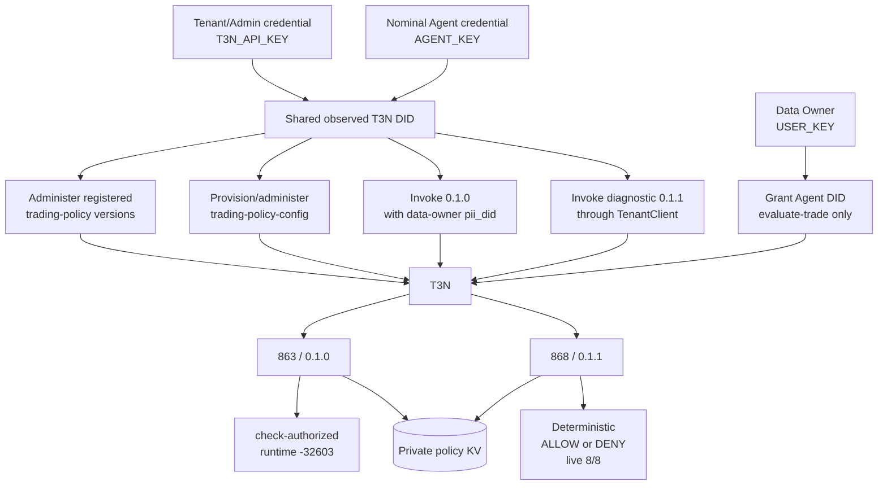
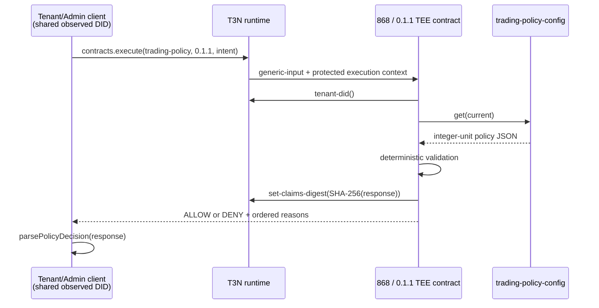

# Architecture

## Credential paths and observed T3N identity



The code separates credentials into different modules and intended processes:

- `tenant-admin.ts` reads only `T3N_API_KEY` and constructs `TenantClient`.
- `data-owner.ts` reads only `USER_KEY` and constructs a plain `T3nClient` for SelfOnly delegation administration.
- `agent.ts` reads only the nominal `AGENT_KEY` and constructs a plain `T3nClient` for business invocation.
- `demo.ts` imports only the agent connector and retains the original 0.1.0 path.
- `demo-live-0.1.1.ts` is an explicitly labelled diagnostic Tenant/Admin path for the successful 0.1.1 test.

This is an application-architecture separation, not a demonstrated T3N authorization boundary. On 2026-09-02, different tenant/admin and nominal-agent credential values both authenticated as `did:t3n:f62da0c78b9ffd0fce31193d4e7db02f272adc0e`. Using only `AGENT_KEY`, all probed tenant control-plane reads succeeded. No write permission was tested, so the ability to register contracts, change ACLs, rewrite policy, or perform other admin mutations is unknown.

## Agent onboarding and authorization

The project used the public/self-authenticating agent onboarding flow. The separately issued credential produced its own authenticated session but resolved to the same observed DID as the tenant/admin credential. Possible account-scoped credential or onboarding semantics require Terminal 3 clarification.

The data owner uses the SDK helper implementing the documented `agent-auth-update` flow. In SDK 5.5.0, `updateAgentAuth` performs the read/merge/write, preserves unrelated agent/contract rows, and writes this grant:

```text
agentDid     = <session-derived agent DID>
scriptName   = z:<tenant-id>:trading-policy
versionReq   = 0.1.0
functions    = [evaluate-trade]
scopes       = []
readScopes   = []
allowedHosts = []
```

The 0.1.0 nominal-agent invocation supplies the authorizing data-owner DID as `pii_did`. Contract 863 imports the vendored `host:interfaces/authorisation@2.1.0` interface and calls `check-authorized` before policy access. It repeatedly returned `action.execute` `-32603 Internal error` before any result was decoded.

Diagnostic contract 868 / 0.1.1 removes only the authorisation import and entry call. Tenant context, KV access, policy logic, response shape, and claims digest remain. Its direct TenantClient live demo passed all eight scenarios. This strongly isolates the tested failure to the authorisation path, but does not prove the platform root cause and does not demonstrate agent/data-owner authorization.

## Version comparison

| Property | 863 / 0.1.0 | 868 / 0.1.1 |
|---|---|---|
| WIT authorisation import | `host:interfaces/authorisation@2.1.0` | Absent |
| Entry authorization | `check-authorized([])` | Absent |
| Tenant context | `host:tenant/tenant-context@1.0.0` | Preserved |
| Policy KV | `host:interfaces/kv-store@2.1.0` | Preserved |
| Runtime result | `-32603 Internal error` | 8/8 live scenarios passed |
| Security meaning | Intended authorization design, not executable in tested runtime | Diagnostic policy workaround, no caller-authorization claim |

## Successful diagnostic flow



## Contract modules

- `models.rs`: strict JSON models, integer cents/basis points, and response enums.
- `policy.rs`: pure deterministic evaluator and native unit tests.
- `lib.rs`: tenant-derived map name, KV read, response serialization, and claims-digest setting. The current 0.1.1 source intentionally omits the 0.1.0 authorization call.
- `world.wit`: current 0.1.1 imports tenant context and KV only. There is no HTTP, signing, wallet, exchange, or outbox capability.

Malformed trade JSON or invalid unit ranges return `DENY / INVALID_INPUT`. Missing, malformed, or invalid stored policy returns an infrastructure error. Version 0.1.1 does not enforce caller authorization and must remain a diagnostic/workaround version.

## Integer determinism

Money uses `u64` cents and confidence uses `u16` basis points constrained to `0..=10000`. Validation order is symbol, venue, notional, daily loss, confidence, then side. Exact boundaries are inclusive. No floating point, clock, randomness, network, market data, or LLM participates in evaluation.

`dailyLossUsdCents` remains agent-supplied. It is range-checked but not trusted accounting data; production must source it from protected ledger/accounting state.

## Policy storage and convergence

| Resource | Canonical name |
|---|---|
| Contract | `z:<tenant-id>:trading-policy` |
| Policy map | `z:<tenant-id>:trading-policy-config` |

The setup process checks map lifecycle, creates it only if absent, and then unconditionally applies the desired update using SDK-confirmed `maps.update`. This recovers from a prior run that created the map but failed before ACL/admin configuration.

Desired final configuration:

| Property | Value |
|---|---|
| Visibility | `private` |
| Readers | readers-only update requested contract IDs 863 and 868 |
| Writers | empty contract set |
| Admin readable | `true` |
| Policy key | `current` |

SDK 5.5.0 exposes lifecycle status and patch-only updates but no ACL metadata read in `TenantMapsNamespace`. The readers-only `[863, 868]` patch was accepted with response `{}`, but the effective ACL could not be independently read back. No visibility, writers, admin-readable, validator, grants, or policy value field was sent in that diagnostic update.

## Audit wording

The contract sets a SHA-256 transaction claims digest over the exact serialized decision. The project has not retrieved and independently verified a receipt. Receipt retrieval and verification remain future work; no stronger audit claim is made.
