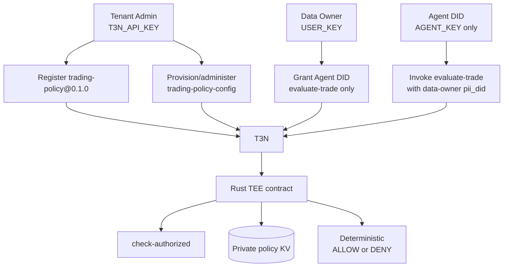
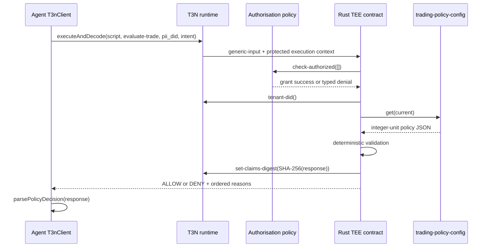

# Architecture

## Principals and responsibilities



The tenant administrator, data owner, and agent are distinct security principals. Their credentials are consumed by different modules and intended to run in separate processes:

- `tenant-admin.ts` reads only `T3N_API_KEY` and constructs `TenantClient`.
- `data-owner.ts` reads only `USER_KEY` and constructs a plain `T3nClient` for SelfOnly delegation administration.
- `agent.ts` reads only `AGENT_KEY` and constructs a plain `T3nClient` for business invocation.
- `demo.ts` imports only the agent connector; it has no tenant control-plane path.

A prompt-injected agent does not possess `T3N_API_KEY` or `USER_KEY`, so it cannot register contracts, change map ACLs, rewrite policy, or expand its own authorization grant through these application paths.

## Agent onboarding and authorization

The project uses the documented public/self-authenticating agent flow. A fresh credited claim-page key authenticates as its own T3N session and produces a session-returned agent DID. Public agent-card creation/hosting is a manual CLI onboarding step.

The data owner uses the SDK 5.5.0 `updateAgentAuth` read/merge/write helper for the publicly documented `agent-auth-update` flow. It preserves unrelated agent/contract rows and writes this grant:

```text
agentDid     = <session-derived agent DID>
scriptName   = z:<tenant-id>:trading-policy
versionReq   = 0.1.0
functions    = [evaluate-trade]
scopes       = []
readScopes   = []
allowedHosts = []
```

The live agent invocation supplies the authorizing data-owner DID as `pii_did`. The contract imports the vendored `host:interfaces/authorisation@2.1.0` interface and calls `check-authorized` before policy access. A missing, revoked, wrong-contract, wrong-version, or wrong-function grant therefore fails closed.

The WIT surface is confirmed locally, but an empty-host authorization check for a KV-only tenant contract has not yet been exercised on testnet. That live compatibility check is explicitly pending.

## Contract flow



## Contract modules

- `models.rs`: strict JSON models, integer cents/basis points, and response enums.
- `policy.rs`: pure deterministic evaluator and native unit tests.
- `lib.rs`: authorization check, tenant-derived map name, KV read, response serialization, and claims-digest setting.
- `world.wit`: imports only tenant context, authorization, and KV. There is no HTTP, signing, wallet, exchange, or outbox capability.

Malformed trade JSON or invalid unit ranges return `DENY / INVALID_INPUT`. Missing, malformed, or invalid stored policy returns an infrastructure error. Authorization failure returns an error before policy is read. Every path fails closed.

## Integer determinism

Money uses `u64` cents and confidence uses `u16` basis points constrained to `0..=10000`. Validation order is symbol, venue, notional, daily loss, confidence, then side. Exact boundaries are inclusive. No floating point, clock, randomness, network, market data, or LLM participates in evaluation.

`dailyLossUsdCents` remains agent-supplied. It is range-checked but not trusted accounting data; production must source it from protected ledger/accounting state.

## Policy storage and convergence

| Resource | Canonical name |
|---|---|
| Contract | `z:<tenant-id>:trading-policy` |
| Policy map | `z:<tenant-id>:trading-policy-config` |

The setup process checks map lifecycle, creates it only if absent, and then unconditionally applies the desired update using SDK-confirmed `maps.update`. This recovers from a prior run that created the map but failed before ACL/admin configuration.

Desired final configuration:

| Property | Value |
|---|---|
| Visibility | `private` |
| Readers | current registered contract ID only |
| Writers | empty contract set |
| Admin readable | `true` |
| Policy key | `current` |

SDK 5.5.0 exposes lifecycle status and idempotent updates but no typed full-map metadata read in `TenantMapsNamespace`. Setup therefore converges by reapplying all desired properties rather than claiming it independently introspected each stored property.

## Audit wording

The contract sets a SHA-256 transaction claims digest over the exact serialized decision. The project has not retrieved and independently verified a receipt. Receipt retrieval and verification remain future work; no stronger audit claim is made.
