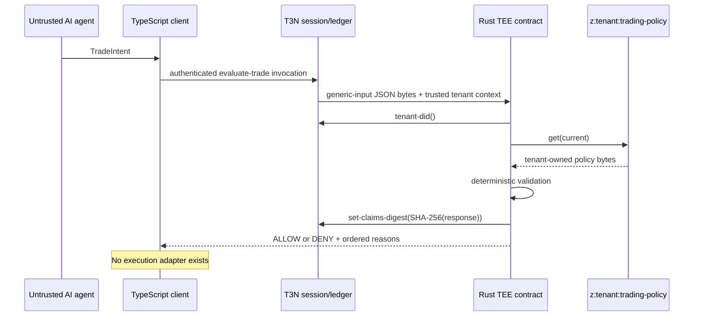

# Architecture

## Security boundary

The upstream AI is a proposal generator, not an authority. Its only input to the protected path is a `TradeIntent`. It cannot supply policy, choose another tenant namespace, call an exchange, or override the decision algorithm.

## Components

### Rust contract

- `models.rs` defines strict JSON models and machine-readable enums.
- `policy.rs` contains the pure deterministic evaluator used by native tests.
- `lib.rs` implements the WIT export, derives the map name from trusted `tenant-context`, reads policy through `kv-store`, serializes the decision, and commits its digest.
- `world.wit` imports only `tenant-context` and `kv-store`. Absence of HTTP, signing, outbox, and exchange interfaces is intentional.

The function returns an infrastructure error when policy is missing, malformed, or invalid. It returns `DENY / INVALID_INPUT` for malformed or structurally invalid trade intent. This separates an unavailable security control from an ordinary rejected proposal while failing closed in both cases.

### TypeScript client

- `t3n.ts` owns testnet selection, API-key presence validation, SDK WASM loading, handshake, authentication, session-derived tenant DID, and `TenantClient` construction.
- `register-contract.ts` registers one fixed tail/version and writes guarded local metadata.
- `setup.ts` provisions and verifies private tenant policy storage.
- `demo.ts` runs eight fixtures either through an explicitly labeled local harness or the live T3N contract.

### Tenant policy storage

The confirmed SDK 5.5.0 surface supplies `maps.create`, `entrySet`, `entryGet`, and `getStatus`. The confirmed WIT surface supplies `kv-store.get`. The resulting map is canonicalized by the SDK as `z:<tenant-id>:trading-policy` and the contract independently reconstructs the same name from the raw 20-byte tenant DID supplied by the host.

Map configuration:

| Property | Value | Purpose |
|---|---|---|
| Visibility | `private` | Avoid public policy reads |
| Readers | registered contract ID only | Contract can enforce policy |
| Writers | empty contract set | Business contract cannot rewrite policy |
| Admin readable | `true` | Tenant administrator can verify bootstrap state |
| Entry key | `current` | Stable policy lookup |

The management-plane tenant administrator initializes policy. The demo does not implement general policy mutation.

## Determinism

Validation has a stable order: symbol, venue, notional, daily loss, confidence, then side. Exact boundary values are allowed. Strings are exact and case-sensitive. No clock, randomness, network, market data, or LLM is consulted.

The `dailyLossUsd` value is supplied in the intent for the scope of this bounty. In a production design it must come from trusted accounting state inside the protected boundary; accepting an agent-authored loss figure is a documented limitation.

## Auditability

Every live invocation is a T3N contract transaction. The contract hashes the exact serialized response with SHA-256 and calls the confirmed `set-claims-digest` host API. A verifier with the transaction receipt can correlate the returned decision bytes to the ledger claim. This demo does not yet provide an append-only decision-query UI or receipt verification CLI.
